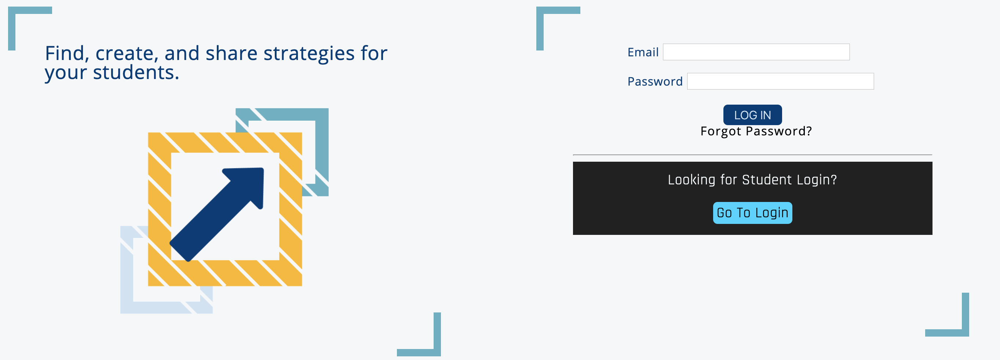
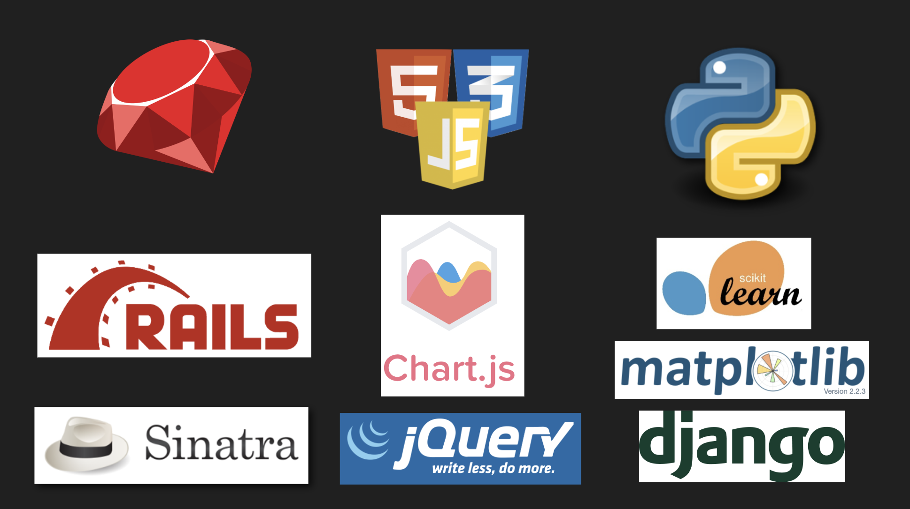

# Here To Learn

<p align="center">
 
</p>

## Empowering teachers to help students reach their fullest potential.
 [Here to Learn](https://young-anchorage-86985.herokuapp.com) is a Rails application in production on [Heroku](https://www.heroku.com/) that tracks vital statistics, collects student and teacher input, uses machine learning to predict test outcomes and highlights students in need of extra attention.

 Here To Learn works with a [Django application](https://github.com/blake-enyart/heretolearn_django) that utilizes a trained machine learning model developed [here](https://github.com/blake-enyart/heretolearn_django/blob/master/jupyter_notebook/ml-generator.ipynb) on over 5000 data points to predict test outcomes based on eating and sleeping habits.

 In addition, the Rails application works with the [Surveys](https://github.com/JennicaStiehl/surveys) application, also hosted on Heroku, which is a stand alone Sinatra application built in the spirit of Service Oriented Architecture (SOA) and stores survey information gathered from students.

### Contributing
* [Carrie Walsh](https://github.com/carriewalsh) - Developed and designed the main [Here To Learn](https://github.com/carriewalsh/HereToLearn) Ruby on Rails app
* [William Peterson](https://github.com/wipegup) - Oversaw machine learning microservice development and Rails app attendance functionality through websockets
* [Jennica Stiehl](https://github.com/JennicaStiehl) - Developed and designed the [Surveys](https://github.com/JennicaStiehl/surveys) Sinatra app
* [Blake Enyart](https://github.com/blake-enyart) - Developed the [Machine Learning Microservice](https://github.com/blake-enyart/heretolearn_django) django app and chart.js integration
* [Trevor Nodland](https://github.com/tnodland) - Assisted in Rails app design, sentiment analysis, and dockerization

### Location of Apps in Production
* [Here to Learn](https://young-anchorage-86985.herokuapp.com) - Rails based central app designed for user interface
* [Django application](http://lit-fortress-28598.herokuapp.com/) - Django based machine learning microservice
* [Surveys](https://aqueous-caverns-33840.herokuapp.com) - Sinatra based database microservice

### Rails App Dependencies
* [Ruby 2.4.1](https://ruby-doc.org/core-2.4.1/)
* [Rails 5.2.3](https://guides.rubyonrails.org/)

### Local Configuration
```
bundle install
rake db:{create,migration,seed}
```

### Notable Gems
* [Fast JSON:API](https://github.com/Netflix/fast_jsonapi)
* [Faraday](https://github.com/lostisland/faraday)
* [Capybara](https://github.com/teamcapybara/capybara/blob/3.12_stable/README.md)
* [RSpec](http://rspec.info/)

### Tech Stack

<p align="center">
 
</p>
